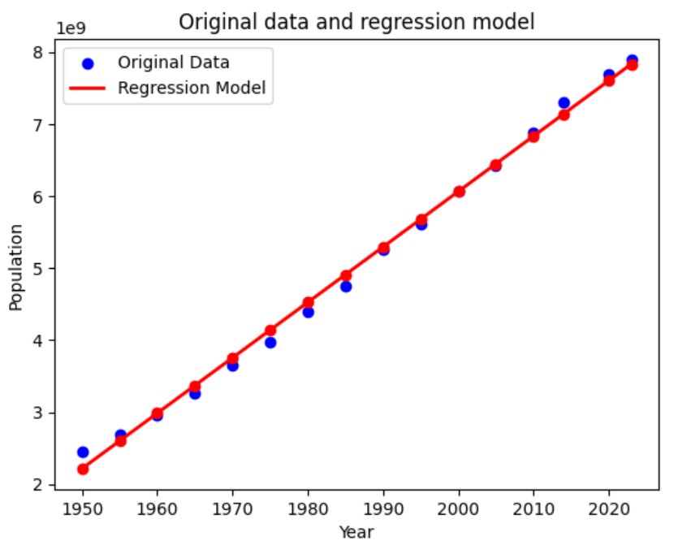

# Linear Regression

El modelo de regresión lineal utilizado tiene como objetivo predecir la población mundial en función del año. Se basa en la suposición de que existe una relación lineal entre el año y la población, lo que significa que el crecimiento o la disminución de la población a lo largo del tiempo puede ser modelado como una línea recta.

El modelo utiliza el año como variable independiente (predictora) y la población mundial como variable dependiente (objetivo). A medida que el tiempo avanza, se espera que la población mundial aumente gradualmente debido a factores como el crecimiento demográfico, la urbanización, la mejora de la atención médica y otros cambios socioeconómicos.

Al ajustar el modelo de regresión lineal a los datos históricos de población mundial a lo largo de los años, podemos obtener una línea que mejor se ajuste a estos datos. Esta línea nos permite hacer predicciones sobre la población futura en función de los años que aún no han ocurrido.

[Explora el análisis completo aqui](mi_notebook.ipynb)

